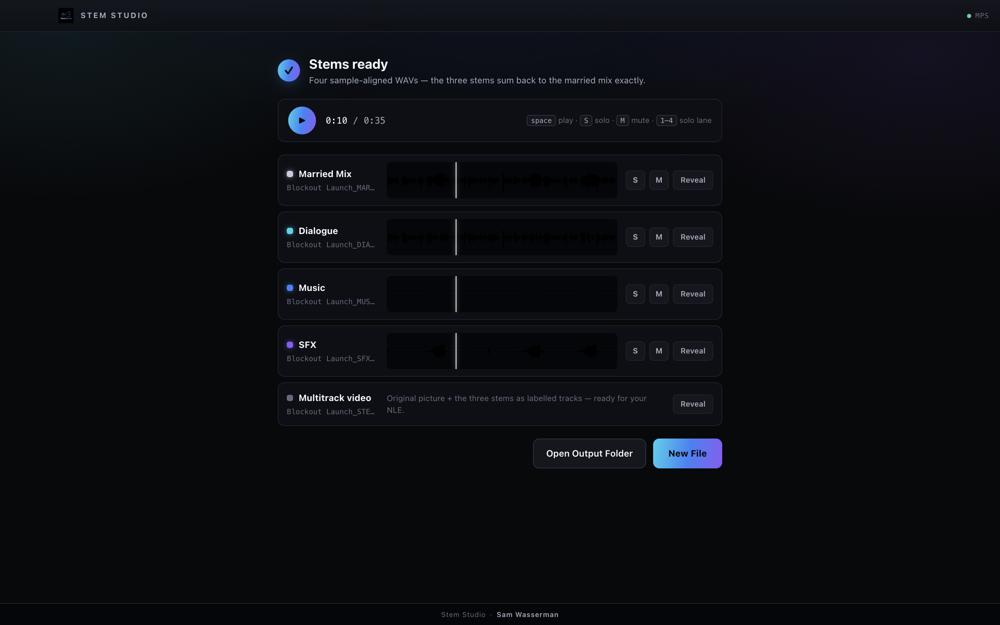
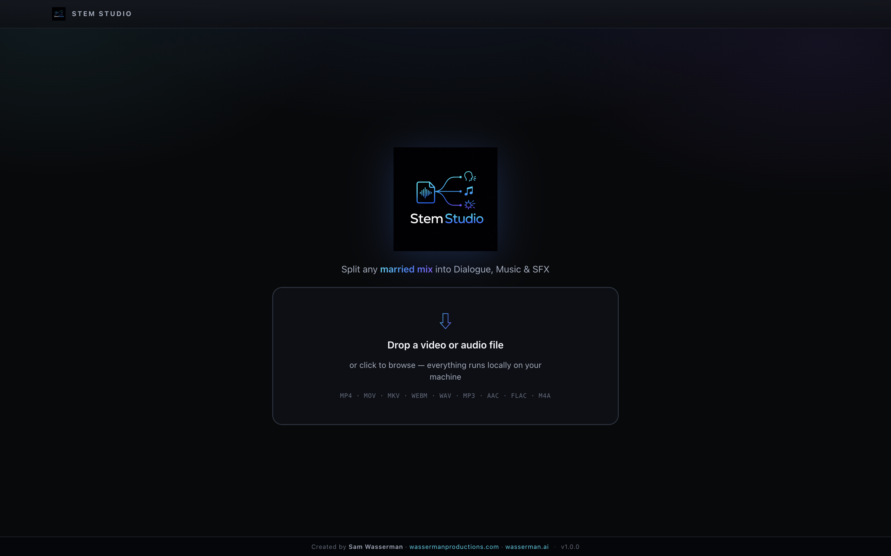
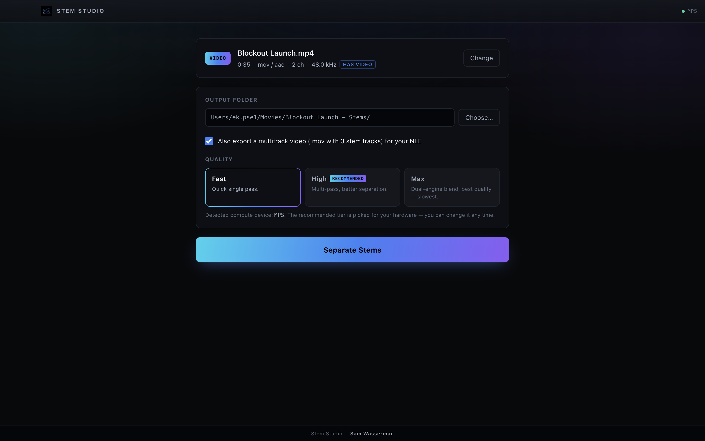
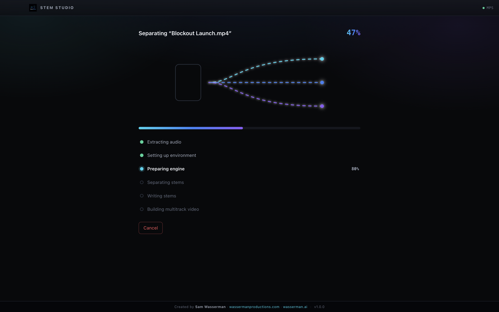

<!-- Modified for cross-platform Windows support in 2026; see MODIFICATIONS.md. -->
<div align="center">

# Stem Studio

**Un-marry a soundtrack.** Drop in a video or audio file where dialogue, music, and effects are mixed on one track — get back three clean stems ready for your edit.



</div>

---

A "married" mix is one where dialogue, music, and sound effects are baked onto a single track — which is what you get from most delivered videos and reference cuts, and exactly what you *don't* want when you need to rebalance, replace the score, or duck the music under a line. Stem Studio separates that one track into three:

- 🗣️ **Dialogue**
- 🎼 **Music**
- 💥 **SFX**

Output is three broadcast-ready **WAV** files (48 kHz, 24-bit), plus a **`<name>_MARRIED.wav`** — the full original mix conformed to the same spec so all four files are format-identical and sample-aligned. When the input is a video, Stem Studio can also remux the original picture with the three stems as separate, labelled audio tracks into a **`<name>_STEMS.mov`** you drop straight into any NLE.

**Current version: 1.1.0**

Stem Studio is part of Sam Wasserman's AI-film tool suite (Blockout, Motion Previs Studio, Storyboard Reference Studio).

## What you get

For an input named `scene12`, Stem Studio delivers, in your chosen output folder:

- **`scene12_MARRIED.wav`** — the conformed full mix (48 kHz / 24-bit).
- **`scene12_DIALOGUE.wav`** — the dialogue stem.
- **`scene12_MUSIC.wav`** — the music stem.
- **`scene12_SFX.wav`** — the sound-effects stem.
- **`scene12_STEMS.mov`** — *(video inputs only, optional)* the original picture plus the three stems as separate, labelled audio tracks, ready to import into any NLE.

All four WAVs are format-identical and sample-aligned. Everything runs **locally** — no upload, no account.

## Screenshots

<table>
  <tr>
    <td width="50%"></td>
    <td width="50%"></td>
  </tr>
  <tr>
    <td align="center"><em>Drop a video or audio file to begin.</em></td>
    <td align="center"><em>Pick your output folder and quality tier.</em></td>
  </tr>
  <tr>
    <td width="50%"></td>
    <td width="50%"></td>
  </tr>
  <tr>
    <td align="center"><em>Live progress as the mix is split.</em></td>
    <td align="center"><em>Four sample-aligned stems — preview, solo, and reveal.</em></td>
  </tr>
</table>

## What it does

1. Open a video (`mp4` / `mov` / `mkv` / `webm`) or audio (`wav` / `mp3` / `aac` / `flac` / `m4a`) file — drag-drop or **Open File**.
2. Stem Studio probes it (duration, sample rate, channels, whether it has picture), then normalizes the audio to the separation engine's working rate.
3. It runs the separation worker, streaming live progress: *Extracting audio → Loading engine → Separating → Writing stems*.
4. You get `<name>_DIALOGUE.wav`, `<name>_MUSIC.wav`, `<name>_SFX.wav`, and `<name>_MARRIED.wav` (the conformed full mix) in your chosen output folder — with per-stem preview playback and **Show in Folder** (or **Reveal in Finder** on macOS). Video inputs optionally also produce `<name>_STEMS.mov`.

### The "nothing lost" guarantee

The three stems sum back to the original mix **exactly, sample-for-sample** — nothing in the source is dropped or duplicated on the way through.

## Requirements

- **Windows 11 x64**, **macOS Apple silicon**, or **Linux arm64 + CUDA** (for example an [NVIDIA DGX Spark](#running-on-nvidia-dgx-spark)). Windows 10 is best effort.
- Windows packages include a checksum-verified BtbN GPL FFmpeg/FFprobe pair and uv bootstrapper, with no system Python, PATH, or registry changes. macOS arm64 packages download a pinned, audited GPL media pair (or rebuild it from pinned source with `npm run prepare:ffmpeg:mac -- --build-from-source`); Linux keeps the existing system-tool fallback and never bundles another platform's runtime.
- macOS/Linux source builds may use system FFmpeg and Python 3.10+ through the existing fallback paths.
- **Node 22+** — for development only.

## Install & first run

On the **first separation**, Stem Studio sets up its private Python environment and downloads the pinned separation model automatically. Windows installs CPython 3.12.10 inside the app data directory using bundled uv 0.11.28, preflights 6 GB of free space, and marks the runtime ready atomically so an interrupted setup can safely retry. Nothing is added to system PATH or the registry.

Windows defaults to the certified CPU profile. NVIDIA users may opt into the
experimental CUDA 12.8 profile by setting `STEMSTUDIO_WINDOWS_PROFILE=cuda`
before launch. If CUDA installation or verification fails, setup removes the
incomplete environment and automatically rebuilds the pinned CPU profile.

### Quality modes

Pick a quality tier in the UI (or with `--quality` on the CLI):

- **Fast** — a quick single pass. The default on machines without a GPU.
- **High** — multi-pass; better separation, a few times slower.

The UI defaults the tier to the compute device it detects, and you can always change it.

### Windows installer status

The Windows target is an unsigned, assisted, per-user NSIS installer for
Windows 11 x64. Because the prerelease is unsigned, Windows SmartScreen may
show an unknown-publisher warning; verify the published SHA-256 before choosing
**More info → Run anyway**.

`npm run package:win` builds the generic upstream-ready identity after native
asset preparation, notice validation, and the fail-closed redistribution audit.
Derivative distributions must keep their identity overlays on their own
release branches so they cannot overwrite this build.

Before publishing, complete the [Windows VM acceptance checklist](docs/WINDOWS_VM_ACCEPTANCE.md).

### Polish dialogue

An optional toggle (off by default). When on, Stem Studio runs a post-separation pass over the dialogue stem to clean music and effects bleed out of the voices — best for dialogue-heavy footage; the pass itself takes only a moment. Whatever it removes is folded into the SFX stem, so the four delivered files still sum back to the original mix sample-for-sample.

## Dev setup

```bash
npm install            # Node 22+
npm run dev            # run the app with hot reload
npm run build          # production build into out/
npm start              # run the production build
npm run typecheck      # strict TS (renderer+shared, main)
npm run lint           # ESLint
npm test               # Vitest unit tests
npm run package        # macOS DMG into release/ (unsigned by default)
```

### Python worker (dev)

For development the app prefers a **repo-local `.venv`** if one exists, so you can run the pipeline without the first-run setup screen:

```bash
python3 -m venv .venv
.venv/bin/pip install -r python/requirements.txt

# end-to-end worker test: synthesize a tone, separate it, assert 3 non-silent stems
PYTHONPATH=python .venv/bin/python python/test_worker.py
```

Run the worker CLI directly:

```bash
# default engine; model files cache in a repo-local dir for dev
PYTHONPATH=python STEMSTUDIO_CACHE_DIR=cache/models .venv/bin/python \
  -m stemstudio_worker.separate --input input.wav --outdir /tmp/stems \
  --engine tiger --quality fast

# torch-free band-split stub (test harness only)
STEMSTUDIO_ENABLE_TEST_ENGINES=1 PYTHONPATH=python .venv/bin/python -m stemstudio_worker.separate \
  --input input.wav --outdir /tmp/stems --engine stub
```

The worker CLI is:

```
python -m stemstudio_worker.separate \
  --input <wav> --outdir <dir> \
  [--engine tiger] [--quality fast|high] [--cache-dir <dir>] \
  [--polish-dialogue]
```

`--polish-dialogue` (off by default) runs an optional post-separation pass that reduces residual music/effects bleed in the dialogue stem; the removed bleed is folded into the effects stem so the three stems still sum to the input exactly.

and `python -m stemstudio_worker.separate --probe` prints one JSON line describing the resolved compute device and exits.

## Separation engine

The Python worker is **engine-agnostic**: `separate.py` owns the CLI, WAV I/O, and progress protocol, while the actual separation is provided by interchangeable **separation engine modules** behind a common interface. Public Windows production configuration exposes licensed TIGER only. Existing macOS/Linux behavior retains the upstream MVSEP/Max and dependency-light stub paths; Windows test runs can enable the stub explicitly with `STEMSTUDIO_ENABLE_TEST_ENGINES=1`.

- **Device.** Selection order everywhere is **CUDA → MPS → CPU**; override with `STEMSTUDIO_DEVICE=cuda|mps|cpu`. On Apple silicon that means MPS; on an NVIDIA box (e.g. a [DGX Spark](#running-on-nvidia-dgx-spark)) it means CUDA. A GPU is *strongly* preferred — CPU separation is dramatically slower. Run `python -m stemstudio_worker.separate --probe` to print the resolved device as one JSON line.
- **Quality modes.** Public Windows builds expose `fast|high`: `fast` is a quick single pass and `high` is a slower multi-pass ensemble. Existing macOS/Linux builds also retain upstream `max` (the dual-engine blend). Windows accelerators default to High, non-Windows CUDA defaults to Max, MPS defaults to High, and CPU defaults to Fast.
- **Chunked overlap-add.** Long audio is processed in bounded ~30 s blocks with a 1 s Hann-crossfaded overlap (`pipeline.chunked_overlap_add`), so peak memory is independent of input length and blocks join without seams.
- **Mixture consistency ("nothing lost").** After separation the residual `mix − (dialogue + music + effects)` is folded back into the effects stem, so the three stems sum to the original mix **sample-for-sample** (verified `max|residual| < 1e-6`). The worker writes 32-bit float stems to preserve this bit-exactly through to the ffmpeg delivery step.

## Engine contract

The actual separation is any object implementing the `Engine` protocol:

```python
class Engine(Protocol):
    def load(self, progress_cb) -> None: ...
    def separate(self, audio: np.ndarray, sr: int, progress_cb) -> dict[str, np.ndarray]:
        # returns {"dialogue": ..., "music": ..., "effects": ...}
        ...
```

**CLI:** `python -m stemstudio_worker.separate --input <wav> --outdir <dir> [--engine tiger] [--quality fast|high] [--cache-dir <dir>]` writes `dialogue.wav`, `music.wav`, `effects.wav` into `<dir>` (defaults: `--engine tiger --quality fast`). `python -m stemstudio_worker.separate --probe` prints one JSON line describing the device/torch stack and its available engines/qualities. Windows defaults to TIGER Fast/High and requires the explicit source-only research gate for MVSEP/Max; macOS/Linux retain their existing engine choices.

**Stdout — line-delimited JSON:**

```jsonc
{"event":"progress","stage":"loading|separating|polishing|writing","percent":0-100}
{"event":"done","outputs":{"dialogue":"…","music":"…","effects":"…"}}
{"event":"error","message":"…"}
```

To add a separation engine module, implement the protocol in a new module and construct it in `separate.main()` — nothing else changes. The input sample rate the engine receives is `ENGINE_SAMPLE_RATE` (`src/shared/types.ts`); the main process resamples every input to it.

## Pipeline

```
input.(mov|mp4|wav|…)
   │  ffprobe → duration / sample rate / channels / hasVideo
   │  ffmpeg  → stereo WAV @ ENGINE_SAMPLE_RATE (job temp dir)
   ▼
stemstudio_worker.separate  →  dialogue.wav · music.wav · effects.wav
   │  ffmpeg → each stem @ 48 kHz / 24-bit PCM  →  <name>_{DIALOGUE,MUSIC,SFX}.wav
   │  ffmpeg → full mix @ 48 kHz / 24-bit PCM   →  <name>_MARRIED.wav
   ▼  (video inputs, optional)
ffmpeg remux: -map 0:v + 3× -map N:a, -c:v copy -c:a pcm_s24le,
              track titles Dialogue/Music/SFX  →  <name>_STEMS.mov
```

The `_STEMS.mov` carries the three stems + video; the format-identical, sample-aligned **`<name>_MARRIED.wav`** (the conformed full mix) is delivered as a fourth standalone WAV alongside the stems.

## Running on NVIDIA DGX Spark

Stem Studio runs on an **NVIDIA DGX Spark** (GB10 Grace Blackwell, DGX OS = Ubuntu-based, arm64, CUDA, 128 GB unified memory), where the existing Linux **Max** tier remains the default. First-run steps:

1. **ffmpeg** — `sudo apt update && sudo apt install -y ffmpeg`. Stem Studio resolves `ffmpeg`/`ffprobe` from `/usr/bin`, `/usr/local/bin`, then `PATH`.
2. **Python 3.10+** — DGX OS ships a suitable `python3`; Stem Studio builds and manages its own venv under the app's data folder on first separation (no manual venv needed).
3. **PyTorch + CUDA** — first-run setup installs the worker's libraries, then checks `torch.cuda.is_available()`. If an NVIDIA GPU is present (`nvidia-smi`) but the default wheel is CPU-only, it automatically reinstalls `torch`/`torchaudio` from the CUDA aarch64 index (`https://download.pytorch.org/whl/cu128`; cu128 = CUDA 12.8, required for Blackwell). This step is a large download — allow a few minutes.
4. **Expected behavior** — the device probe reports `cuda`, so the Linux UI retains its upstream **Max** default. The pinned TIGER model downloads on first use. Everything runs locally on the GPU.

### Performance

TIGER-DnR is an unusually launch-bound model — a single forward issues on the order of 50k tiny per-band conv/attention kernels — so on the GB10 the wall time is dominated by CUDA kernel-launch overhead rather than raw math (the GPU already runs at ~95 % SM utilisation). To counter that, on CUDA the TIGER engine `torch.compile`s its three source sub-models (fusing those kernels) and runs the whole file in a single block (the model does its own internal overlap-add, so peak memory stays ~2.5 GB regardless of clip length). Output is unchanged aside from the tiny numerical difference of fused kernels, and separations remain deterministic once the graph is warm. The `torch.compile` graph is built during model load — expect a one-time ~30 s warmup on the first separation of a session (cached under a temp dir for subsequent runs in the same process).

Measured on a DGX Spark (GB10, CUDA 13, torch 2.13) for a 100 s stereo clip, warm model cache:

| Tier | Before | After | Approx. RTF (after) |
| --- | --- | --- | --- |
| `tiger --quality fast` | 2m37s | 1m35s | ~0.95× |

RTF is wall-clock ÷ audio duration (lower is faster; below 1.0× is faster than realtime). The steady-state TIGER separation itself runs at ~0.6× realtime; the end-to-end wall additionally includes model load, the one-time compile warmup, and WAV I/O.

Packaging Linux builds (AppImage + `.deb`, arm64) is configured in `electron-builder.yml` under `linux`.

## Drive it from an AI agent

An MCP stdio server lets Claude Code, Codex, or any MCP client run the pipeline headlessly (no Electron) — see [mcp/README.md](mcp/README.md).

## Support

A few people asked if they could send tips to support my work developing open source tools. So I set up an optional way in case anyone wants to.

No pressure at all. Using the apps, sharing them, starring the repositories, and contributing code all help too. Thank you.

- [GitHub Sponsors](https://github.com/sponsors/wassermanproductions)
- [Ko-fi](https://ko-fi.com/samwasserman)

## License

Apache-2.0 © 2026 Sam Wasserman. See [LICENSE](LICENSE) and [NOTICE](NOTICE) — retain the NOTICE and credit "Sam Wasserman (wassermanproductions.com · wasserman.ai)" in derivative works.

Created by **Sam Wasserman** — [wassermanproductions.com](https://wassermanproductions.com) · [wasserman.ai](https://wasserman.ai)

Windows support contributed and maintained by **Gumbii Digital** ([github.com/GumbiiDigital](https://github.com/GumbiiDigital)) — see [MODIFICATIONS.md](MODIFICATIONS.md).
