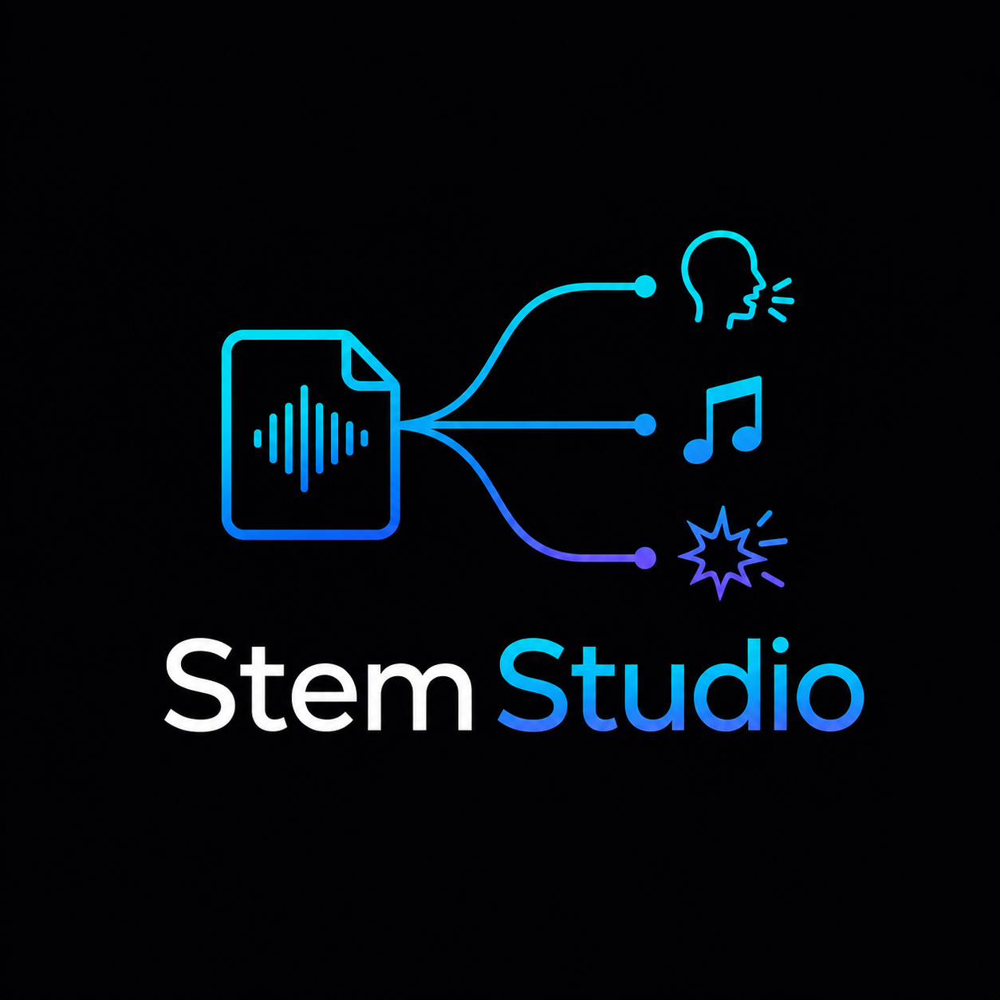

# Stem Studio Operator Handbook

**Windows, macOS, and Linux standard operating procedures**

**Project:** Stem Studio

**Original application:** Sam Wasserman / Wasserman Productions

**Document status:** Maintainer review draft
**Edition:** Revision 05 - 2026-07-14

## Purpose

Stem Studio separates one married soundtrack into Dialogue, Music, and SFX while preserving a conformed Married reference. It is designed for editorial review and return to an external nonlinear editor. This handbook covers first-run setup, quality selection, separation, audition, aligned delivery, recovery, and agent-assisted operation.

Stem Studio changes the soundtrack, not the picture. It does not compose music, perform the final creative mix, or replace editorial listening.

## What the Windows work accomplished

The cross-platform implementation added a prerequisite-free Windows 11 workflow while retaining the existing application architecture:

- A private, application-managed Python environment that does not modify the system path or registry.
- Pinned runtime, model, and dependency inputs with integrity verification and resumable setup.
- Disk preflight, setup progress, cancellation, retry, and repair actions.
- Packaged FFmpeg and FFprobe with documented environment overrides.
- Public Windows production modes limited to licensed TIGER Fast and High.
- Separate CPU and optional CUDA profiles with automatic CPU fallback.
- Windows-safe process-tree termination for Python, runtime setup, encoders, and workers.
- Portable preview URLs, File Explorer terminology, and separator-safe output names.
- Packaged headless MCP operation sharing the managed runtime, worker, media tools, and model cache.

### How it was achieved

The Electron application remains responsible for media probing, setup orchestration, process ownership, and delivery. A versioned readiness manifest makes first-run setup atomic: interrupted setup can resume or rebuild without relying on global Python. The Python worker keeps one JSON-line progress contract regardless of compute profile. Output conversion and multitrack remuxing use the same packaged media toolchain as the desktop application.

## Output contract

For a source named `PROJECT_MIX`, a successful production separation creates:

| Output | Purpose | Standard delivery |
|---|---|---|
| `PROJECT_MIX_DIALOGUE.wav` | Speech and dialogue-focused stem | 48 kHz, 24-bit WAV |
| `PROJECT_MIX_MUSIC.wav` | Music-focused stem | 48 kHz, 24-bit WAV |
| `PROJECT_MIX_SFX.wav` | Effects and ambience stem | 48 kHz, 24-bit WAV |
| `PROJECT_MIX_MARRIED.wav` | Conformed full-mix reference | Same start, channels, rate, and duration |
| Optional multitrack MOV | Original picture plus labeled audio tracks | For external NLE import |

> **Alignment rule:** all four WAVs must share the same start, channel count, sample rate, and sample count. Dialogue + Music + SFX should reconstruct Married within the documented numerical tolerance.

## Quality decision

| Mode | Use when | Tradeoff |
|---|---|---|
| Fast | First editorial pass, long-form review, or constrained hardware | Shortest turnaround; use as the default audition pass |
| High | The approved source needs a stronger production comparison | Longer processing and higher resource use |
| Dialogue polish | Speech bleed needs a controlled secondary comparison | Must be auditioned; removed energy is folded into SFX to preserve mixture consistency |

Public Windows builds use licensed TIGER Fast or High modes. Do not enable unavailable research or unlicensed modes in a public-production workflow.

## Before every session

1. Confirm the intended source is the original married mix, not an earlier output stem.
2. Record source duration, sample rate, channel count, and a file hash when the project requires strict provenance.
3. Confirm at least 6 GB of free space before first-run setup or model repair.
4. Choose a new versioned output folder.
5. Start with Fast unless a reviewed reason requires High.
6. Decide whether dialogue polish is part of the comparison before processing begins.
7. Keep the Married reference available for every audition.

## Human SOP

### 1. Complete first-run managed setup

1. Launch Stem Studio and review the storage preflight.
2. Start setup and keep the application open while the managed runtime, dependencies, and model files are prepared.
3. Review progress and any download-size information.
4. If setup is interrupted, reopen the application and choose Retry.
5. Use Repair only when the readiness check reports an incomplete or inconsistent environment.
6. Confirm the application reaches the Ready state before importing production media.

**Accept when:** setup reports ready, the private environment passes its readiness manifest, and no system-wide Python change was required.

### 2. Load and verify a married source

1. Choose **New File** and select the approved audio or video source.
2. Confirm the displayed filename, duration, channel count, and sample rate.
3. Play the beginning, midpoint, and end of the source.
4. Confirm the file contains the intended mixture of dialogue, music, and effects.
5. Reject filenames that indicate an existing `_DIALOGUE`, `_MUSIC`, `_SFX`, `_MARRIED`, or `_STEMS` output.

**Accept when:** the loaded source is the approved original married mix and not a recursively separated output.

### 3. Run a Fast editorial pass

1. Select **Fast**.
2. Leave dialogue polish off unless it is part of the approved comparison.
3. Confirm CPU or the intended optional compute profile.
4. Start separation.
5. Monitor extraction, setup, separation, writing, and finalization stages.
6. Keep the application open until the four aligned outputs are reported ready.

**Accept when:** the application reaches Stems ready and returns four existing output paths.

### 4. Run a High comparison

1. Create a new versioned output folder.
2. Select **High**.
3. Record whether dialogue polish is enabled.
4. Start the job and monitor the same stage sequence.
5. Do not overwrite the Fast outputs.
6. Compare Fast and High at the same time ranges before choosing a production version.

**Accept when:** the High outputs are aligned, complete, and independently auditioned against Fast and Married.

### 5. Audition the four lanes

1. Clear every solo and mute state.
2. Select Married and restart at zero.
3. Audition Married from beginning to end.
4. Audition Dialogue, Music, and SFX at the beginning, every story-critical event, and the end.
5. Compare unusually quiet or nearly empty lanes with the source sound plan; silence may be correct, but a classification failure may look identical in a waveform.
6. Use solo and mute controls to locate bleed, missing energy, artifacts, and transient damage.
7. Compare Fast, High, and polish variants at identical time ranges.
8. Record the chosen version and any repair notes for the external editor.

**Accept when:** a human reviewer has heard all required lanes and documented the production choice. Reaching the end of playback with a lane accidentally soloed is not approval.

### 6. Verify alignment and mixture consistency

1. Confirm all four WAVs use the required output sample rate and bit depth.
2. Confirm equal channel count and sample count.
3. Decode to a common floating-point representation for numerical comparison.
4. Sum Dialogue + Music + SFX.
5. Compare that sum with Married and record maximum absolute and RMS residuals.
6. Investigate any result above the documented tolerance before delivery.

**Accept when:** all files align sample-for-sample and the reconstruction gate passes or has an explicit reviewed disposition.

### 7. Return audio to the external editor

1. Import Dialogue, Music, SFX, and Married at the same timeline start.
2. Keep Married muted as a reference after synchronization is confirmed.
3. Rebalance the three production stems in the editor.
4. Check picture sync at the beginning, midpoint, critical events, and final frame.
5. If the source was video, use the optional labeled multitrack MOV when it simplifies editorial import.
6. Export the final movie from the editor and verify the complete delivery contract independently.

**Accept when:** the final edit retains exact picture duration and the approved audio stays synchronized throughout.

### 8. Cancel, retry, or repair safely

1. Choose Cancel in the application.
2. Wait while the application closes the worker, media tools, and any setup process.
3. Confirm the job reaches Cancelled rather than leaving a permanent in-progress state.
4. Remove only the incomplete output version after all processes have closed.
5. Retry into a clean folder.
6. Use Repair only when setup readiness, dependency integrity, or model integrity fails.

## Agent-assisted SOP

### Agent preflight

1. Start the packaged MCP server or the supported development server.
2. Call `setup_status` and wait for ready before production processing.
3. Call `probe_media` on the reviewed source.
4. Reject any output-stem suffix as a routine production input.
5. Keep machine-local paths in the live response only; publish portable filenames and aggregate results.

### Supported agent sequence

1. `setup_status` and, only if required, the approved setup or repair action.
2. `probe_media`.
3. `separate_stems` with TIGER and Fast or High.
4. Poll `check_job` until Done, Error, or Cancelled.
5. Verify returned Dialogue, Music, SFX, Married, and optional multitrack paths.
6. Run alignment and reconstruction checks.
7. Record per-lane level and activity measurements so unexpectedly empty categories are visible to the human reviewer.
8. Return the output version, media contract, numerical QA, and unresolved human listening decisions.

### Mandatory human boundary

An agent may set up, probe, process, poll, cancel, and verify files. A human editor must select the creative quality or polish result, audition for artifacts, rebalance stems, and approve the final mix.

### Agent return record

| Field | Publication-safe record |
|---|---|
| Source | Portable source name and reviewed version |
| Processing | TIGER Fast or High, actual compute profile, and terminal job state |
| Outputs | Portable Dialogue, Music, SFX, Married, and optional multitrack names |
| Objective QA | Media contract, alignment result, reconstruction residual, and per-lane activity summary |
| Human boundary | Listening, polish, rebalance, and final approval still required |

## Production acceptance checklist

- [ ] Input is the approved original married source.
- [ ] Managed runtime is ready and the storage preflight passed.
- [ ] Public Windows production uses TIGER Fast or High.
- [ ] Output folder is a new version.
- [ ] Dialogue-polish state is recorded.
- [ ] Four WAVs exist and share channel count, sample rate, sample count, and duration.
- [ ] Dialogue + Music + SFX reconstruct Married within tolerance.
- [ ] Nearly empty or unusually quiet lanes have a human-reviewed source-intent disposition.
- [ ] Every lane was auditioned with solo and mute state verified.
- [ ] Optional multitrack output has clear track labels.
- [ ] Cancellation or retry leaves no worker, encoder, or locked partial output.
- [ ] Human editorial choice is recorded separately from objective signal QA.

## Recovery guide

| Symptom | Recovery |
|---|---|
| First-run setup stops | Reopen, review readiness, and Retry; use Repair only if integrity remains incomplete. |
| Insufficient free space | Move the application data or clear enough approved storage, then rerun preflight. |
| Optional accelerator fails | Allow automatic CPU fallback and record the actual compute profile. |
| Output names repeat a stem suffix | Stop; select the original married source and process into a clean versioned folder. |
| Preview does not play | Confirm the file exists and reopen the result; do not infer audio quality from a waveform alone. |
| A lane is nearly empty | Compare it with the approved source and sound plan. Accept only when absence is intended; otherwise compare quality modes or repair the separation. |
| Job appears stuck after Cancel | Wait for process-tree closure, then use Repair only if the readiness check fails. |
| Stems do not reconstruct Married | Confirm equal alignment and source identity, then rerun from the original source. |
| Multitrack MOV is missing | Verify that the source contains video and that multitrack delivery was requested. |

## Validation summary

Cross-platform validation covered clean first-run setup, resumable repair, CPU processing, optional accelerator fallback, a stub pipeline on routine changes, licensed TIGER separation, waveform preview, cancellation without orphaned processes, MCP operation, and proof that unavailable public modes stay disabled.

An earlier representative 90-second release-gate validation produced four PCM 24-bit, 48 kHz stereo WAVs with 4,320,000 samples per channel. The three separated stems reconstructed the Married reference with a maximum absolute residual of 4.77 × 10⁻⁷, comfortably below the 1 × 10⁻⁵ validation threshold.

### Current final-film replay status

| Check | Signal Run | The Twelfth Shadow |
|---|---|---|
| Source import on physical Windows | Passed | Passed |
| Visible cancellation | Passed | Not repeated |
| Worker, Python, uv, and FFmpeg cleanup after cancellation | Passed - no orphaned process remained | Covered by the same process-tree contract |
| Full TIGER Fast separation | Passed | Passed |
| Four-WAV alignment and reconstruction | Passed | Passed |
| Labeled multitrack and waveform review | Passed | Passed |
| Objective content-activity scan | Dialogue is very quiet (`-63.85 LUFS`; `6.753%` above `-60 dBFS`) | Music is effectively empty (`-68.75 LUFS`; no samples above `-60 dBFS`) |
| Human creative listening and mix approval | Pending human sign-off | Pending human sign-off |

Each film returned four aligned 24-bit/48 kHz stereo WAVs: 4,320,257 samples per channel and 90.005354 seconds. Both multitrack MOVs expose labeled Dialogue, Music, and SFX. On the same hash-matched WAVs, float-forced residuals were `-128.931373 dBFS` peak for both films and `-137.204667`/`-137.217182 dBFS` RMS for *Signal Run*/*The Twelfth Shadow*. The earlier `-84.288134 dBFS` value was a 16-bit null-output floor; the correction strengthens the passing mixture-consistency result. These checks establish integrity and completion, not creative approval: a human editor must audition every lane.

## Publication and maintenance

- Use fictional filenames and versioned output folders in public examples.
- Do not publish machine-local environment or model-cache paths.
- Never describe objective reconstruction as a substitute for human listening.
- Keep this Markdown as the reviewable source and update it whenever a quality mode, setup stage, output contract, or MCP capability changes.

### Attribution and license

Stem Studio was created by **Sam Wasserman / Wasserman Productions**. Its application source is distributed under the repository's [Apache-2.0 license](../../LICENSE); preserve its NOTICE, copyright, citation, model notices, and third-party obligations. Bundled FFmpeg is a separate GPL component with its own license, provenance, and corresponding-source duties. Keep TIGER notices and the disabled licensing gate for unavailable research modes separate from the application license. The upstream name and logo remain subject to maintainer approval.
